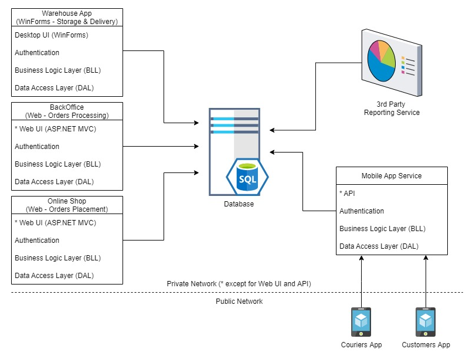
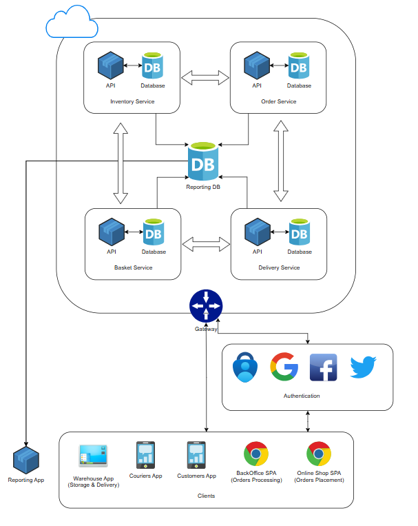

# Determine the architectural style of the solution. Provide an explanation for your choice.

The solution consists of a central enterprise database which integrates all the applications. It is not given in the description, so I will just assume that the database may be hosted on a dedicated server on a separate physical machine, and the business applications may be hosted on other machine(s).

In this case this is a solution made of N-tier applications, each of which is a layered monolith (except for the mobile apps which have clients hosted remotely on customers' devices).

Quite little is known about the reporting service, but it may be again just a web or desktop app which utilizes data connectors to fetch reporting data directly from the central database.

# Draw the architectural diagram of the solution as if you were designing it from scratch. Provide pros and cons of the two solutions.

## Existing solution

Pros:
- Existing separation of business concerns: customers, managers and couriers use specialized apps.
- Simplicity and straightfordwarness of development: you have a single source of truth (the database) and build any integration around it.
- Deployment simplicity: monoliths are relatively simpler to deploy.
- Unified data storage: may be a plus while the app is relatively not big.

Cons: 
- Central integration database is a single point of failure: once the database is down, all the system stops functioning.
- Complexity of change introduction: data models are rigid since they should serve different business purposes (used in different apps simultaneously).
- Weak security posture: each separate application implement its own authentication, expanding the attack surface.
- Code duplication: apparently, customer-faced web and mobile apps share a great deal of business logic which is duplicated in the codebase.
- Siloed components and poor communication: experts are narrowly focused (Database, web apps, desktop apps) lacking cross-functional expertise.
- Single resposibility principle violation: Mobile App Service serves both customers and couriers - completely different business uses.

## Proposed solution

Pros:
- Microservice architecture style introduced for core business contexts (Inventory, Basket, Order, Delivery) facilitates scaling, development and deployment autonomy.
- Heavy reads (Reporting) are separated from operational transactions (Inventory, Basket, etc.); this shields production transactional data from timeouts and locks.
- API Gateway on the edge of the cloud infrastructure increases security, maintainability and usability of the system.
- Unified autentication and authorization mean Usable Security, Separation of concerns, and reduced attack surface.

Cons:
- Overall complexity of distributed systems introduced by the proposed design; it requires high mastery from the team.
- Distributed data persistence introduces eventual consistency to both operational and reporting data; it also increases operational complexity (backups, maintenance, etc.)
- Additional network hops add latency to API calls.