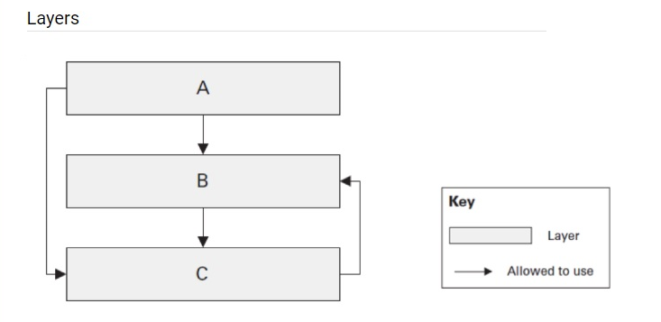

# Name examples of the layered architecture. Do they differ or just extend each other?

# Is the below layered architecture correct and why? Is it possible from C to use B? from A to use C?

According to the canonical definition of the layered architecture, a layer can only depend on another layer which is lower in the hierarchy. So C -> B dependency violates the principles of the Layered Architecture and introduces a circular dependency flaw.

On the other hand, A -> C dependency is permitted in the Layered Architecture, if we treat layer B as open. Such a laxation is acceptable when the layer above the open one uses the layer below naturally. However, this decision should be weighted and cautious as it violates level isolation.

# Is DDD a type of layered architecture? What is Anemic model? Is it really an antipattern?

# What are architectural anti-patterns? Discuss at least three, think of any on your current or previous projects.

# What do Testability, Extensibility and Scalability NFRs mean. How would you ensure you reached them? Does Clean Architecture cover these NFRs?